# PMCGNN
Official code repository of paper [Improving Crystal Property Prediction from a Multiplex Graph Perspective](https://pubs.acs.org/doi/10.1021/acs.jcim.4c01200)  



## Python environment setup with Conda
```
conda create -n pmcgnn python=3.9
conda activate pmcgnn

pip install torch==1.13.1+cu116 torchvision==0.14.1+cu116 torchaudio==0.13.1 --extra-index-url https://download.pytorch.org/whl/cu116
pip install torch-scatter==2.1.0 torch-sparse==0.6.16 torch-cluster==1.6.0 torch-spline-conv==1.2.1 -f https://data.pyg.org/whl/torch-1.13.1%2Bcu116.html
pip install torch-geometric==2.3.1

pip install numpy==1.24.3
pip install matplotlib==3.7.1
pip install jarvis-tools==2022.9.16
pip install ignite==1.1.0
pip install pandas==2.0.2
pip install dgl==1.1.1
pip install periodictable==1.6.1
pip install pydantic==1.10.2
pip install pytorch-ignite==0.4.13
pip install opt-einsum==3.3.0
pip install yacs==0.1.8
pip install tensorboard==2.13.0
```
## Summation Algorithm
We used the summation algorithm from [PotNet](https://github.com/divelab/AIRS/tree/main/OpenMat/PotNet).
## Train Models
```
python main.py --config configs/pmcgnn.yaml
```
## Evaluate Models
```
python main.py --config configs/pmcgnn.yaml  --checkpoint xxx --testing
```
We provide preprocessed files and pretrained models in this [google drive](https://drive.google.com/drive/folders/1e9iYUlCtVdv5T3_D6XmTvs8BdAvXozRg?usp=sharing). 

## Dataset

### JARVIS Dataset
For JARVIS Dataset, we follow PotNet and use the same training, validation, and test set. We evaluate our PMCGNN on five important crystal property tasks, including formation energy, bandgap(OPT), Total energy, Bandgap(MBJ), and Ehull. The training, validation, and test set contains 44578, 5572, and 5572 crystals for tasks of Formation Energy, Total Energy, and Bandgap(OPT). The numbers are 44296, 5537, 5537 for Ehull, and 14537, 1817, 1817 for Bandgap(MBJ). The used metric is test MAE. The baseline results are taken from PotNet.

### The Materials Project Dataset
For The Materials Project Dataset, we follow PotNet and use the same training, validation, and test set. We evaluate our PMCGNN on four important crystal property tasks, including Formation Energy, Band Gap, Bulk Moduli and Shear Moduli. The training, validation, and test set contains 60000, 5000, and 4239 crystals for tasks of formation energy and band gap. The numbers are 4664, 393, 393 for Bulk Moduli and Shear Moduli. The used metric is test MAE. The baseline results are taken from PotNet.
## Benchmarked results
### JARVIS Dataset

### The Materials Project Dataset


## Efficiency


## Acknowledgement
This repo is built upon the previous work PotNet's [[codebase]](https://github.com/divelab/AIRS/tree/main/OpenMat/PotNet), licensed under the GPL-3.0 license.  
This repo is partially based on GRIT's [[codebase]](https://github.com/LiamMa/GRIT/tree/main)

Thank you very much for these excellent codebases. 
